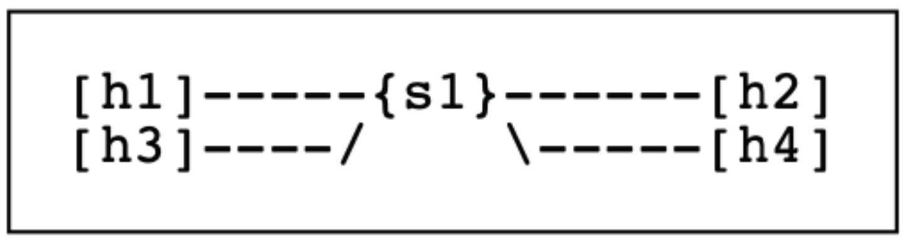
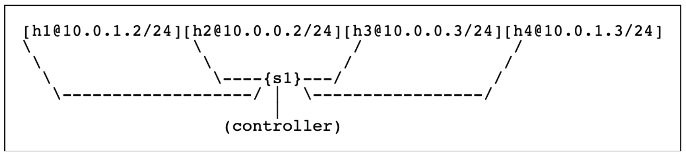
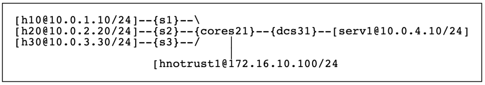

# Assignment #5
In this task, you will learn about Software Defined Networking (SDN).
Using Virtualbox, Mininet, and Pox as the implementers of the OpenFlow protocol, you will build simple networks using SDN primitives.

1.	First, you will learn to use mininet, an SDN-enabled network emulator.
2.	Then, you will be using POX to implement a simple L2 firewall.
3.	Here you will be building an entire network, with multiple switches capable of handling ARP and other traffic.
4.	Lastly, you will be modifying your part 3 solution to implement an actual L3 IP router that handles ARP and routes traffic.

## Part 1
Install Mininet in VirtualBox. (Follow these [instructions](http://mininet.org/download/)).
Play around by typing: `sudo mn` inside of the mininet CLI, try running other commands like `help`, `net`, `nodes`, `links` and `dump`.
Mininet starts with a default network that you can poke at.
-	In the default network, find the mac address of the hosts, the ethernet ports connected, and the hostnames in the system.
-	Programming Mininet Topologies
    - Mininet is also programmable using the python programming language. From here, you will be using the files provided at the [GoogleDrive link](https://drive.google.com/drive/folders/1Uj4_RhBdBk7d4qifAoBGV2tL2yuIPF_Z?usp=sharing). You need to take this folder to the Mininet VM for using the codes.

        _Hint: Use SCP command from the host computer. Inside the folder, you'll find two different directories: topo and pox. Ignore the pox directory for now (it's used in Part-2). In the topo folder, there are a variety of python files and define required network topology. Have a quick look and you will be able to understand how the networks are created in Mininet environment._
  - Please modify `part1.py` to represent the following network topology:

    
    - where
        - [ x ] means you create a host named `x`,
        - {y} means a switch named `y`, and
        - --- means there is a link between the node and the switch
- After creating the above architecture, provide the two items in a part1 folder in a compressed file:
    1. Your modified `part1.py` file
    2. Screenshots of the `iperf`, `dump`, and `pingall` commands (from mininet) in PDF format.

### Results, _output(s) and result(s) stored in `_deliverables\part1.zip`_

  
Environment Setup

  
  - I installed mininet via [apt-get](https://github.com/mininet/mininet/blob/master/INSTALL)
  - I tested the installation, as per [these instructions](http://mininet.org/download/), using port 6654 instead of 6634 (updated Mininet)
  - I completed the [Mininet Walkthrough](http://mininet.org/walkthrough/#part-1-everyday-mininet-usage), approx. 30m to complete
  

  
Designing the 4-host, 1-switch Network Topology

  - Readthrough: `topos` scripts to design and customize mininet architecture using Python API
  - Created a for-loop to iterate over 4 hosts, creating them and setting links between the hosts and the switch.
  - Ran the CLI to test the custom topology
    - execute: `sudo mn --custom path/to/file --topo part1 --test COMMAND`, where `COMMAND` is either `pingall` or `iperf`, not adding a `COMMAND` builds the topology and waits for either further commands (say, `dump`) or an `exit` to end the run
    - output for `pingall`, `iperf`, `dump` are all included as separate PDFs in the `part1.zip` directory
    - output for all in `verbose` (reduced output) included also
  

## Part 2
In part 1, you experimented with Mininet using its internal controller.
In this (and future) parts, you will instead be using a custom controller to send commands to the switches.
Here, we will be using the POX controller, which is written in Python.
___For this part, you will create a simple firewall using OpenFlow-enabled switches.___
The term "firewall" is derived from building construction: a firewall is a wall you place in buildings to stop a fire from spreading.
In the case of networking, it is the act of providing security by not letting specified traffic pass through the firewall.
This feature is good for minimizing attack vectors and limiting the network "surface" exposed to attackers.

In this part, you are provided with the Mininet topology, `part2.py`, to setup your network which assumes a remote controller listening on the default IP address and port number 127.0.0.1:6633.
__You do not need to (and should not) modify this file.__
The topology that this script will setup is as follows.
Note that h1 and h4 are on the same subnet and a different one from h2 and h3.

For part-2, you are also provided with a skeleton POX controller (under pox folder): `part2controller.py`.
This file is required to be modified to create the firewall that implements the following rules.

| src ip   | dst ip   | protocol | action |
|----------|----------|----------|--------|
| any ipv4 | any ipv4 | icmp     | accept |
| any      | any      | arp      | accept |
| any ipv4 | any ipv4 | -        | drop   |

Then, you need to deploy this new controller and run mininet under the new topology provided in `part2.py`.

__Note__: Basically, your Firewall should allow all ARP and ICMP traffic to pass.
However, any other type of traffic should be dropped.
It is acceptable to flood the allowable traffic out all ports.
Be careful! Flow tables match the rule with highest priority first, where priority is established based on the order rules are placed in the table.
When you create a rule in the POX controller, you need to also have POX "install" the rule in the switch.
This makes it so the switch "remembers" what to do for a few seconds.
__Do not handle each packet individually inside of the controller!__
_Hint: To do this, look up `ofp_flow_mod`._
The [OpenFlow tutorial](https://github.com/mininet/openflow-tutorial/wiki) (specifically "Sending OpenFlow messages with POX") and the [POX Wiki](https://noxrepo.github.io/pox-doc/html/) are both useful resources for understanding how to use POX.

__Deliverables__:
1.	Your `part2controller.py` file
2.	Documentation on how you deployed the controller and how you run mininet with new topology.
3.	A screenshot of the ___pingall___ command. Note that h1 and h4 should be able to ping each other (h2 and h3 as well), but not across subnets. Also, the ___iperf___ command should fail (as you're blocking IP traffic). This is realized as the command hanging.
4.	A screenshot of the output of the ___dpctl dump-flows___ command. This should contain all of the rules you've inserted into your switch.

### Results, _output(s) and result(s) stored in `_deliverables\part2.zip`_

  
Environment Setup

  - Readthrough: `pox` API to understand packet flow, and messaging to the controller
  - Ran the Mininet CLI to start the emulation:
    - execute (in older versions of Mininet/POX): `sudo mn --custom path/to/file --topo part2 --controller remote`
    - execute (in newer versions of Mininet/POX): `sudo mn --custom path/to/file --topo part2 --controller remote,port=6633`
  - Then started the POX hub:
    - execute: `sudo ~/pox/pox.py misc.part2controller`, after adding `part2controller.py` to the `~/pox/pox/misc` directory
  

  
Applying the Rules to the Firewall

  - We need to define three rules:
    1. Allow all IPv4 traffic to pass through the firewall.
    2. Allow all ARP protocol traffic to pass through the firewall.
    3. Block all others.
  - So, we design the rules using the `ofp_flow_mod` library. On creating these messages, we send them to the switch to "install" the message to the controller.
    - since IPv4 traffic uses 32 bits to express the data, we use `0x0800` hex code
    - since we want to allow ARP traffic to pass, we check the lower 8 bits, or `0x0806` in hex
  - To run the emulation:
    1. Run the Mininet topology (`part2`): `sudo mn --custom path/to/file --topo part2 --controller remote`
    2. Run the POX hub (`part2controller.py`): `sudo ~/pox/pox.py misc.part2controller`
  - `outputs.pdf` includes:
    - output of the `pingall` command
    - output of the `iperf` command
    - output of the `dpctl dump-flows` command
  - `outputs_v2.pdf` includes: _now returning ipv6, and other ipv4 traffic back to sender_
    - output of the `pingall` command
    - output of the `iperf` command
    - output of the `dpctl dump-flows` command _the rules have changed to include these additions_
  

  
References

  - Completing the [OpenFlow tutorial](http://github.com/mininet/openflow-tutorial/wiki/Create-a-Learning-Switch#Sending-OpenFlow-messages-with-POX)
  - Following a [3rd-party tutorial on POX Controllers](http://sdnhub.org/tutorials/pox/)
  - The POX API
  	- on [ofp_flow_mod](http://noxrepo.github.io/pox-doc/html/#ofp-flow-mod-flow-table-modification)
  	- on [match](http://noxrepo.github.io/pox-doc/html/#match-structure)
  - This [Open vSwitch Manual](http://openvswitch.org/support/dist-docs-2.5/ovs-ofctl.8.txt)
  

## Part 3
In part 2 you have implemented a simple firewall that allowed ICMP packets but blocked all other packets.
For your part 3, you will be expanding on this to implement routing between subnets and implementing firewalls for certain subnets.
The idea is to simulate an actual production network.

We will be simulating a network for a small company (topology is shown in the picture below).
Assume that the company has a 3-floor building, with each floor having its own switch and subnet.
Additionally, we have a switch and subnet for all the servers in the data center, and a core switch connecting everything together.
Note that the names and IPs are not to be changed.
You are provided the topology `./topos/part3.py` as well as a skeleton controller `./pox/part3controller.py`.
As with part 2, you need only modify the controller only.

Your goal will be to allow traffic to be transmitted between all the hosts.
In this part, you will be allowed to flood traffic on the secondary routers (s1, s2, s3, dcs31) in the same method that you did in part-2 (using a destination port of ___of.OFPP_FLOOD___).
However, for the core router (cores21) you will need to specify specific ports for all IP traffic.
You may find it easiest to determine the correct destination port by using the destination IP address and source IP address, as well as the source port on the switch that the packet originated from.
Additionally, to protect our servers from the untrusted Internet, we will be blocking all IP traffic from the Untrusted Host to Server.
- To block the Internet from discovering our internal IP addresses, we will also block all ICMP traffic from the Untrusted Host. In summary of your goals:
    - Create a Pox controller (as per part-2) with the following features: All nodes able to communicate __EXCEPT__
        - hnotrust1 cannot send ICMP traffic to h10, h20, h30, or serv1.
        - hnotrust1 cannot send any IP traffic to serv1.

__Deliverables__:
1. Your `part3controller.py` file.
2. A screenshot of the ___pingall___ command. All nodes but hnotrust should be able to send and respond to pings.
3. A screenshot of the ___iperf hnotrust1 h10___ and ___iperf h10 serv1___ commands. Though not shown in these commands, hnotrust should not be able to transfer to serv1. It should be able to transfer to other hosts.
4. A screenshot of the output of the ___dpctl dump-flows___ command. This should contain all of the rules you've inserted into your switches.

### Results, _output(s) and result(s) stored in `_deliverables\part3.zip`_

  
Traffic Blocking in the Network

  
  - Traffic "within the system" (or, internal as sometimes referred to in the program)
    - Allow ICMP/ARP, IPv4, IPv6 traffic between __h10__, __h20__, __h30__, and __serv1__
      - This is allowable via switches __s1__, __s2__, __s3__, and __dcs31__
      - All of their switches are connected to the main switch __cores21__. Through this switch is where I take into account their ports for directing traffic from, e.g., __h10__ to __serv1__, which goes from __h10__ -> __s1__ -> __cores21__ -> __dcs31__ -> __serv1__. Because __serv1__ controls all of the flow, it will guide traffic to the right ports (in the above example, traffic is routed to/from ports 4 and 1)
    - I instead __flood__ all of the outgoing ports to direct traffic in each of the switches (other than __serv1__)
  - Traffic to/from "external" hosts (or, __hnotrust1__)
    - To not allow any ICMP/ARP requests, these requests are "returned to the sender" when communicating with this host to any of the others "in the network"
    - To not allow any IPv4/IPv6 traffic to __serv1__, these packets are also "returned to the sender" when communicating with this host to __serv1__
    - To allow IPv4/IPv6 traffic to/from __h10__, __h20__, or __h30__ these packets are routed via their switches (and through __cores21__) to/from ports 5 (if going to __hnotrust1__) and 1/2/3 (if going to __h10__, __h20__, or __h30__)
  

  
References

  
  - Again, the POX Wiki on:
    - [ofp_flow_mod](http://noxrepo.github.io/pox-doc/html/#ofp-flow-mod-flow-table-modification) for adding rules
    - [match](http://noxrepo.github.io/pox-doc/html/#match-structure) for rules
  - The [ovs fields man page](http://manpages.debian.org/testing/openvswitch-common/ovs-fields.7.en.html)
  - The course [text](http://bit.ly/2X0RWmU): "Computer Networking: A Top-Down Approach", Kurose & Ross (7th Ed) _various sections in Ch4/5 on SDN_
  

